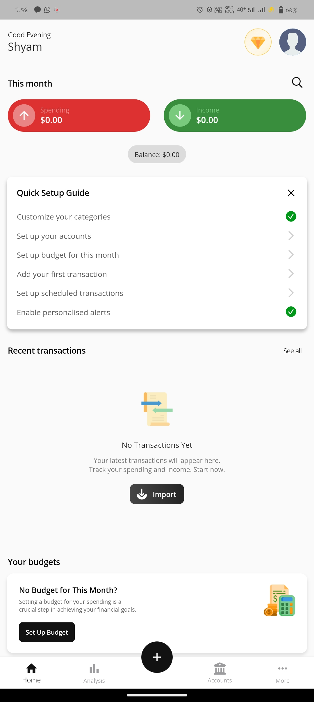
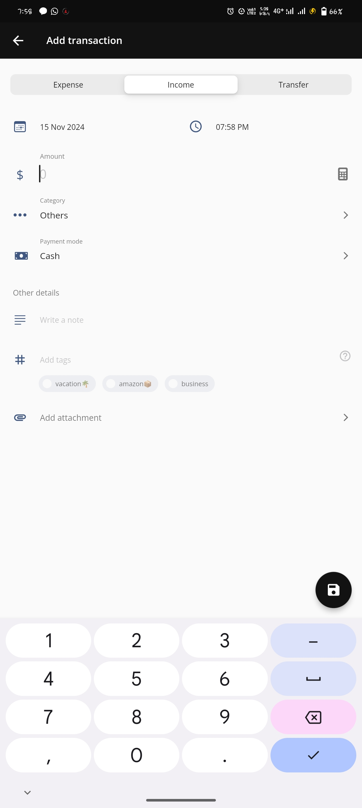
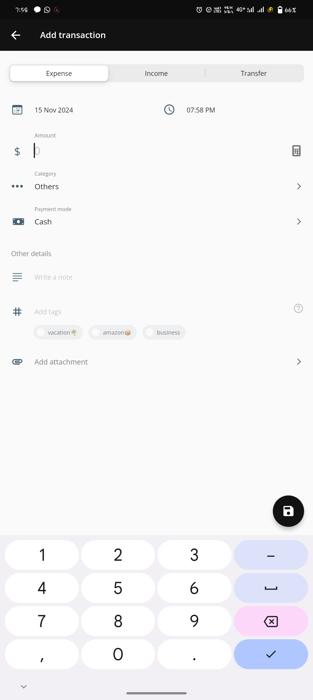
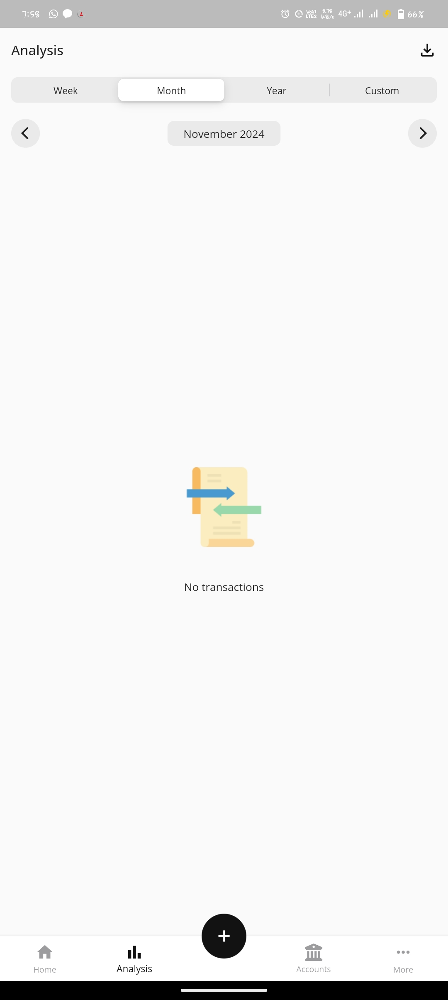
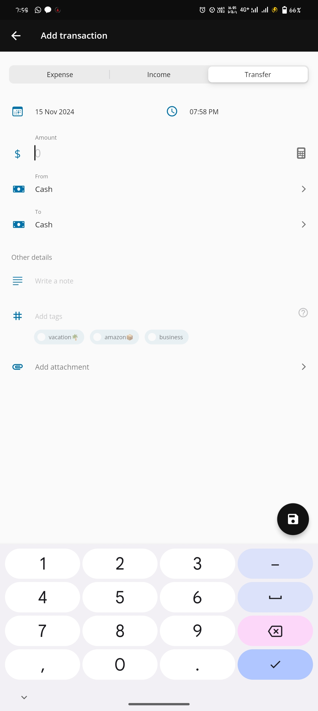
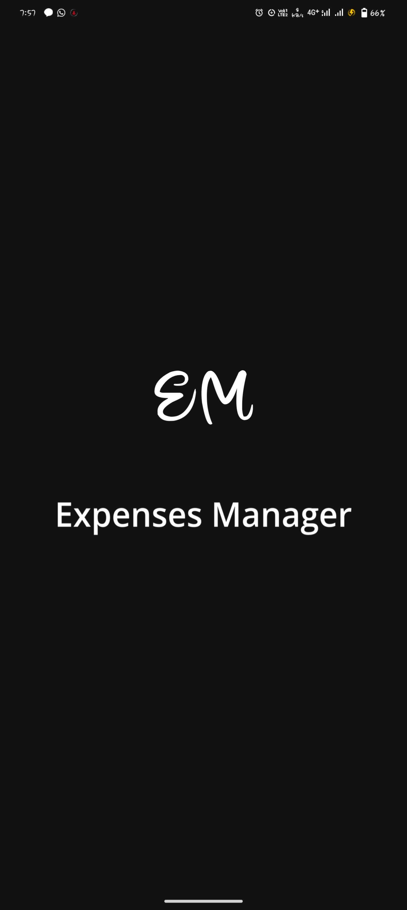

Here’s the updated README.md without the flutter run step:

# Expense Manager 📊  
**Effortlessly manage your personal finances with Money Matters!**  

Expense Manager is a robust personal finance management app designed to help you track, analyze, and improve your financial health. Whether you want to monitor your expenses, categorize your spending, or get AI-driven suggestions to save money, Expense Manager has got you covered.  

---

## Features ✨  

- **Expense & Income Tracking:** Log your daily transactions with ease.  
- **Smart Categorization:** Organize your finances with customizable expense and income categories.  
- **Currency Selection:** Choose your preferred currency for accurate tracking.  
- **Savings Insights:** Get AI-powered suggestions to lower your expenses and boost savings.  
- **Price Comparison:** Use the AI assistant to compare prices and optimize your spending.  
- **Interactive Chatbot:** Manage income, track expenses, and plan budgets with an intuitive AI chatbot.  

---

## Installation 🚀  

1. Clone the repository:  
   ```bash
   git clone https://github.com/BugBae/Android-application-master.git

2. Navigate to the project directory:

cd Android-application-master


3. Build and install the APK:

Use your preferred tools (e.g., Termux or Android Studio) to compile and install the app on your Android device.


---

Screenshots 📸

### Dashboard


### Income Tracking


### Expense Tracking


### Analysis


### Transfer Management


### Profile


### App Logo


---

Technologies Used 🛠️

Flutter: Framework for building natively compiled apps.

Dart: Programming language used for Flutter development.

Termux: Environment for building and running the app.

AI Integration: Custom AI solutions for financial suggestions and chatbot functionality.


---

Package Details 📦

App Name: Expense Manager

Author: T3CH D3V1L5

Package Name: com.t3chd3vil5.moneymatters


---

License 📜

This project is licensed under the MIT License.

---

Contact 📧

For inquiries, suggestions, or support, contact us at:
Email: support@t3chd3vil5.com
Website: T3CH D3V1L5


---

Let’s make managing money easier and smarter with Expense Manager!


